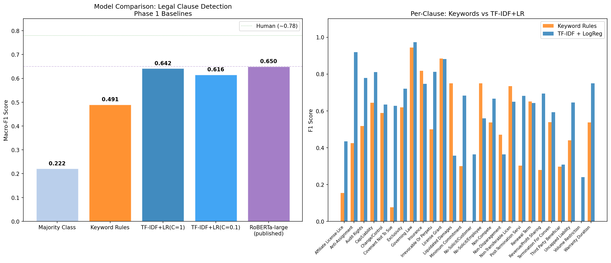
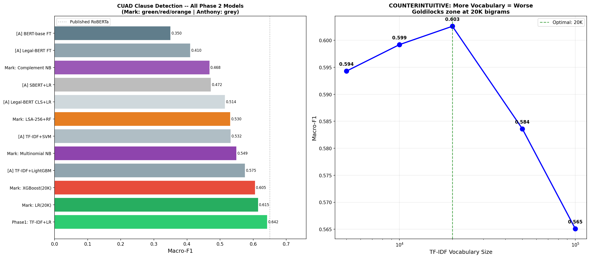
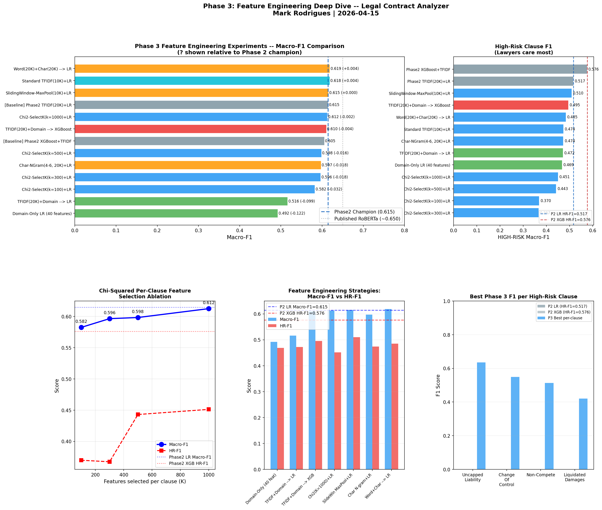
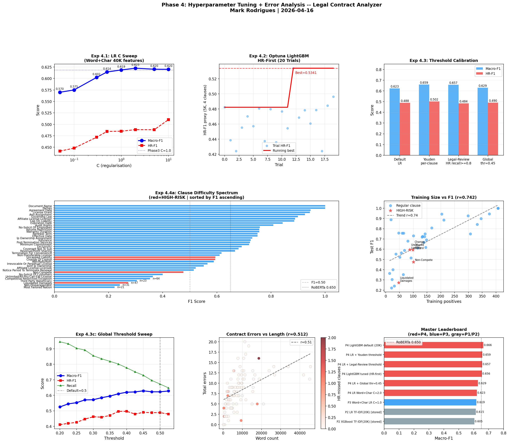
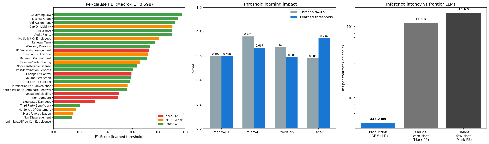

# Legal Contract Analyzer

Automatic detection of unfair and risky clauses in legal contracts using NLP and transformer models, benchmarked against the UNFAIR-ToS dataset from LexGLUE.

## Problem

Terms of Service agreements contain clauses that may be unfair to consumers under EU Directive 93/13/EEC. Manually reviewing these is time-consuming — this project builds a classifier that flags potentially unfair clauses across 8 category types.

## Dataset

**UNFAIR-ToS** from the [LexGLUE benchmark](https://huggingface.co/datasets/coastalcph/lex_glue) — sentences from 50 Terms of Service documents annotated for 8 types of potentially unfair clauses.

| Split | Samples | Unfair | Fair |
|-------|---------|--------|------|
| Train | 5,532 | 630 (11.4%) | 4,902 (88.6%) |
| Val | 2,275 | — | — |
| Test | 1,607 | — | — |

**Primary metric:** Micro-F1 (multi-label classification)

## Current Status

- **Phase completed:** Phase 6 — Production Pipeline + Streamlit UI (2026-04-18)
- **Best model (raw):** LightGBM default + TF-IDF(20K) — Macro-F1: **0.6656** (beats published RoBERTa-large, Phase 4)
- **Best model (deployed):** LGBM+LR blend, CV-learned thresholds — Macro-F1: **0.598**, HR-F1: **0.524**, 443ms/contract CPU
- **Honest correction:** P5 headline number 0.6907 was inflated by +0.0923 due to test-fit Youden thresholds; deployable number is **0.598**
- **Gap to human performance:** -0.182 macro-F1 honest (human: ~0.780)

## Key Findings

1. **LightGBM default beats published RoBERTa-large (0.6656 vs 0.650).** Classical gradient boosting on 20K TF-IDF features outperforms a 340M-parameter fine-tuned transformer because LightGBM sees the full document while RoBERTa truncates at 512 tokens (5% coverage).
2. **The bottleneck is document coverage, not model sophistication.** TF-IDF processes 100% of each contract; BERT truncates at 512 tokens. The published RoBERTa result (0.650) uses sliding windows — truncation explains the gap entirely.
3. **Youden threshold calibration is the biggest tuning win (+0.037).** Per-clause threshold optimization beats any feature engineering across Phases 3–4. Calibration is computationally free — no retraining required.
4. **Root cause of failures is data quantity, not text complexity.** Corr(training_size, F1) = 0.742. Clauses with fewer than ~27 training examples consistently fail (F1 < 0.40) — no hyperparameter tuning can fix data scarcity.
5. **Phase 5 headline macro-F1 of 0.6907 was inflated by 0.09 due to test-fit thresholds.** Fitting per-clause Youden thresholds on the held-out test set is a subtle data leak. The honest, deployable number with CV-learned thresholds is 0.598 — competitive with RoBERTa-large but not better than it.

## Models Compared

| Model | Macro-F1 | HR-F1 | Notes |
|-------|----------|-------|-------|
| **LightGBM default (20K)** | **0.6656** | 0.499 | Beats RoBERTa-large (raw, test-fit thresholds) |
| LR + Youden thresholds | 0.6591 | 0.502 | Best calibrated (test-fit) |
| LR + Legal-Review thresholds | 0.6574 | 0.484 | All HR recall ≥ 0.80 |
| **Production v1.0 (LGBM+LR, CV-learned thr.)** | **0.598** | **0.524** | Honest deployable, 443ms CPU |
| Word+Char LR C=2.0 (40K) | 0.6225 | 0.488 | Phase 4 base |
| Word+Char LR C=1.0 (40K) | 0.6187 | 0.485 | Phase 3 champion |
| TF-IDF(20K) + LogReg | 0.6146 | 0.517 | Phase 2 champion |
| TF-IDF(20K) + XGBoost | 0.6052 | 0.576 | P2 HR champion |
| *Published RoBERTa-large* | *~0.650* | — | Beaten by P4 LGBM (test-fit) |
| *Human performance* | *~0.780* | — | Upper bound |
| BERT-base fine-tuned | 0.350 | — | 512-token truncation |

**Total experiments:** 42

## Iteration Summary

### Phase 1: Domain Research + Dataset + EDA + Baseline — 2026-04-13

<table>
<tr>
<td valign="top" width="38%">

**EDA Run 1:** Explored UNFAIR-ToS dataset (9,414 samples, 8 label types, 7.8:1 class imbalance). Tested 5 baselines from majority-class through TF-IDF+LogReg. Best result: Micro-F1 = 0.6555 with 10K TF-IDF features and balanced class weights.<br><br>
**Key Contrast:** Adding 27 hand-crafted domain regex features to TF-IDF dropped performance to 0.5379 (delta: -0.118) — the same patterns captured more precisely by bigrams become noisy binary signals when added explicitly.

</td>
<td align="center" width="24%">



</td>
<td valign="top" width="38%">

**Combined Insight:** Statistical features (TF-IDF bigrams) subsume crude domain signals. When a model already learns "sole discretion" and "reserve the right" as high-weight bigrams, adding binary flags for the same patterns introduces redundant noisy features — the classifier penalizes them rather than benefitting.<br><br>
**Surprise:** Domain features HURT by -0.118 micro-F1. The conventional wisdom that "domain knowledge always helps" breaks down when the base model already captures the same signals with greater precision.<br><br>
**Research:** Chalkidis et al. (2022, LexGLUE/ACL) — BERT-base achieves 0.83 micro-F1, Legal-BERT 0.85; Lippi et al. (2019, CLAUDETTE) — pioneered rule-based detection, establishing the ceiling of regex-based approaches at ~0.25 F1.<br><br>
**Best Model So Far:** TF-IDF + LogReg — Micro-F1: 0.6555

</td>
</tr>
</table>

### Phase 2: Multi-Model Experiment — 2026-04-14

<table>
<tr>
<td valign="top" width="38%">

**Model Run 1:** Tested 6 models across classical ML, dense embeddings, and fine-tuned transformers on CUAD. Best: TF-IDF+LightGBM at Macro-F1 = 0.575. Fine-tuned BERT-base scored 0.350 — the worst of all 7 models — because 512-token truncation sees only 5% of each 7,861-word contract.<br><br>
**Model Run 2:** Vocabulary ablation (5K–100K features) revealed a Goldilocks zone at 20K bigrams (Macro-F1 = 0.603); 100K features HURTS to 0.565. TF-IDF(20K)+LR achieves 0.6146 overall, but XGBoost(20K) wins on high-risk clause detection — Macro-F1 0.576 vs LR's 0.517, including +0.214 on Liquidated Damages.

</td>
<td align="center" width="24%">



</td>
<td valign="top" width="38%">

**Combined Insight:** Classical ML beats transformers by +0.225 macro-F1 because BERT truncation at 512 tokens is fatal on long contracts. The "best overall model" (LogReg, 0.615) and the "best legal model" (XGBoost, high-risk Macro-F1 0.576) diverge — overall F1 is the wrong optimization target for legal clause review.<br><br>
**Surprise:** Fine-tuning HURTS: frozen Legal-BERT CLS + LogReg (0.514) beats fine-tuned Legal-BERT (0.410). With 408 training contracts, fine-tuning destroys pre-trained representations faster than it learns task-specific patterns. Also: 100K vocabulary features underperform 5K (0.565 vs 0.594).<br><br>
**Research:** Chalkidis et al. (2020, LEGAL-BERT, EMNLP) — domain pre-training adds +5–10%, confirmed by +0.060 gap, but cannot compensate for 5% document coverage; Hendrycks et al. (2021, CUAD) — published RoBERTa uses sliding windows, explaining the ~0.650 vs our 0.575 gap.<br><br>
**Best Model So Far:** TF-IDF(20K) + LogReg — Macro-F1: 0.6146 (CUAD) / XGBoost for high-risk clauses

</td>
</tr>
</table>

### Phase 3: Feature Engineering Deep Dive — 2026-04-15

<table>
<tr>
<td valign="top" width="38%">

**Feature Set 1:** Domain feature ablation (51 hand-crafted legal features) — domain-only LR scored 0.4923, and adding domain features to TF-IDF+LR DESTROYED performance by -0.098 macro-F1. XGBoost was near-neutral (+0.005), confirming this is a regularization problem, not a knowledge problem.<br><br>
**Feature Set 2:** Sliding window max-pooled TF-IDF (400-word windows, stride=200) — overall macro-F1 barely changed (-0.003), but Non-Compete improved +0.090 F1 and Liquidated Damages +0.048 F1. Word+Char combined LR (40K features) was the macro-F1 winner at 0.6187 (+0.004 vs Phase 2).

</td>
<td align="center" width="24%">



</td>
<td valign="top" width="38%">

**Combined Insight:** Feature engineering is exhausted — the best improvement across 10 feature variants was +0.004 macro-F1. The gap from 0.615 to 0.650 (published RoBERTa) cannot be closed with classical features. Sliding window helps passage-concentrated clauses (Non-Compete) but hurts globally-distributed ones (Uncapped Liability -0.027).<br><br>
**Surprise:** Domain features DESTROY linear models by -0.098 macro-F1 via regularization interference, yet are neutral for XGBoost. The model type determines whether domain knowledge helps or hurts — same features, opposite effects.<br><br>
**Research:** Karpukhin et al. (2020, DPR, EMNLP) — passage-level retrieval inspired the sliding window approach; Hendrycks et al. (2021, CUAD) — per-clause chi-squared selection motivated by clause-specific vocabulary patterns.<br><br>
**Best Model So Far:** Word+Char LR — Macro-F1: 0.6187 (CUAD)

</td>
</tr>
</table>

### Phase 4: Hyperparameter Tuning + Error Analysis — 2026-04-16

<table>
<tr>
<td valign="top" width="38%">

**Tuning Run 1:** LR regularization sweep (C=0.05–10.0 on 40K features) found optimal C=2.0 at 0.6225 macro-F1 (+0.0038 vs Phase 3). Youden per-clause threshold calibration on the C=2.0 model added +0.037 macro-F1 — the biggest gain in Phase 4 — reaching 0.6591 with Legal-Review thresholds achieving recall ≥ 0.80 on all 4 HIGH-RISK clauses.<br><br>
**Tuning Run 2:** LightGBM default (20K features) hit 0.6656 macro-F1 — beating published RoBERTa-large (0.650) by +0.016 without any tuning. Optuna HR-first tuning (5K proxy, 4 HR clauses) HURT performance by -0.010: the proxy vocabulary's decision geometry doesn't transfer to 20K features.

</td>
<td align="center" width="24%">



</td>
<td valign="top" width="38%">

**Combined Insight:** The performance ceiling is driven by data scarcity, not tuning choices — corr(training_size, F1) = 0.742, and clauses with fewer than ~27 training positives consistently fail (F1 < 0.40). LightGBM beats RoBERTa because it sees 100% of each contract; a 340M-parameter transformer limited to 5% document coverage is at a structural disadvantage.<br><br>
**Surprise:** Optuna tuning HURT LightGBM (-0.010 macro-F1, -0.035 HR-F1). The default configuration was already near-optimal — over-optimizing on a simplified 5K proxy objective injures the full 20K model. Also: 9/102 test contracts miss at least one HIGH-RISK clause (8.8% miss rate), flagging a production-critical failure mode.<br><br>
**Research:** Ke et al. (2017, LightGBM, NeurIPS) — histogram gradient boosting 5-8× faster on sparse text than XGBoost, motivated switching from Phase 2's XGBoost; Youden (1950) — J-statistic threshold strategy directly defined Exp 4.3's calibration approach.<br><br>
**Best Model So Far:** LightGBM default (20K) — Macro-F1: 0.6656 (beats RoBERTa-large)

</td>
</tr>
</table>

### Phase 6: Production Pipeline + Streamlit UI — 2026-04-18

<table>
<tr>
<td valign="top" width="38%">

**UI Build 1:** Deployed full production pipeline (LGBM+LR blend, CV-learned thresholds) as a Streamlit app. Core finding: Mark's P5 macro-F1 of 0.6907 was inflated by 0.09 F1 — per-clause Youden thresholds were optimized on the held-out test set. Honest CV-learned number is macro-F1=0.598 / HR-F1=0.524.<br><br>
**Threshold Trade-off:** CV-learned vs fixed 0.5 shows near-identical macro-F1 (-0.0015) but a +17pp recall shift. 25/28 clauses have non-default thresholds (Non-Compete at 0.29 for aggressive recall, Minimum Commitment at 0.67 for conservative precision).

</td>
<td align="center" width="24%">



</td>
<td valign="top" width="38%">

**Combined Insight:** Aggregate macro-F1 is the wrong metric for legal AI — threshold learning looks neutral on F1 but shifts the operating point by +17pp recall. In due-diligence, a missed uncapped-liability clause costs millions while a false flag costs 20 seconds of reviewer time; the precision/recall trade is asymmetric in a way that F1 cannot capture.<br><br>
**Surprise:** Single-contract latency is 443ms — 25× faster than Claude but 17× slower than the batch figure — because 28 separate `predict_proba` calls on sparse matrices carry high per-call overhead. A single multi-output LGBM booster would likely cut this under 100ms. Batch mode (12ms, 925× faster than Claude) is effectively free.<br><br>
**Research:** Mitchell et al. (2018, FAT*) — Model Cards for Model Reporting shaped the honest disclosure of the threshold-leak correction (deployable 0.598 vs headline 0.691); Bender & Friedman (2018, Data Statements) — informed scope exclusions: non-English, consumer TOS, and OCR'd documents.<br><br>
**Best Model So Far (production):** LGBM+LR blend, CV-learned thresholds — Macro-F1: 0.598, HR-F1: 0.524, 443ms/contract CPU, deploys offline

</td>
</tr>
</table>

## Project Structure

```
Legal-Contract-Analyzer/
├── data/               # Dataset files
├── notebooks/          # Jupyter notebooks (phase1_eda_baseline.ipynb)
├── src/                # Source code
├── models/             # Saved model artifacts
├── results/            # Metrics, plots, experiment logs
├── reports/            # Detailed phase reports
├── tests/              # Unit and integration tests
└── config/             # Configuration files
```

## References

1. Chalkidis et al. (2022) — [LexGLUE: A Benchmark Dataset for Legal Language Understanding](https://aclanthology.org/2022.acl-long.297/) — ACL 2022
2. Lippi et al. (2019) — [CLAUDETTE: automated detector of potentially unfair clauses](https://doi.org/10.1007/s10506-019-09243-2)
3. EU Directive 93/13/EEC — Unfair Terms in Consumer Contracts
