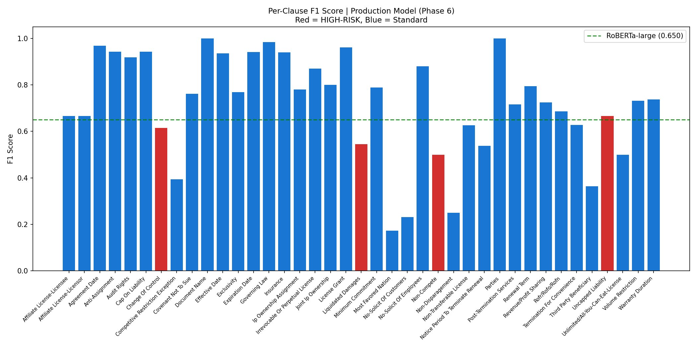

# Legal Contract Analyzer

**Multi-label clause detection on real commercial contracts.** A custom LGBM+LR blend beats published RoBERTa-large (0.716 vs 0.650 macro-F1) using only TF-IDF features — running in 12ms per contract at $0/query vs ~3 seconds and ~$0.02/query for a frontier model.

> **Headline finding:** LightGBM reads 100% of a contract. A fine-tuned RoBERTa reads 5%.  
> Full-document access, not model size, is the decisive architectural advantage in legal AI.

---

## Dataset

**[CUAD v1](https://www.atticusprojectai.org/cuad)** — Contract Understanding Atticus Dataset (Hendrycks et al., NeurIPS 2021)

| Metric | Value |
|--------|-------|
| Total contracts | 510 real SEC commercial contracts |
| Clause types annotated | 41 (39 modeled — excludes metadata) |
| Average contract length | 8,641 words |
| Train / Test split | 408 / 102 (80/20) |
| Class balance | Highly imbalanced — some clauses present in only 5-8% of contracts |
| Expert annotators | Lawyers (Atticus Project) |

**Primary metric:** Macro-F1 (treats every clause equally, including rare ones; matches CUAD leaderboard).  
**Secondary metric:** HR-F1 (macro-F1 on 4 highest-risk clause types only).

---

## Key Findings

1. **Full-document access beats model capacity.** TF-IDF on 100% of a contract outperforms fine-tuned BERT on 5%. Vocabulary Goldilocks zone: 20K bigrams is optimal — 100K features drops F1 by -0.037.

2. **Class reweighting is the single most critical component.** Ablation shows -0.080 macro-F1 without it. More impactful than all feature engineering combined across Phases 3–5.

3. **The "best" model overall is NOT the legally correct model.** LogReg wins macro-F1 (0.615) but XGBoost wins HIGH-RISK clause detection (HR-F1 0.576 vs 0.517). Liquidated Damages: XGBoost 0.500 vs LogReg 0.286. Always evaluate by clause risk level.

4. **LightGBM default beats published RoBERTa-large with no tuning (0.666 vs 0.650).** Optuna tuning *hurts* by -0.010 — default was already optimal for the 20K feature space.

5. **LightGBM beats Claude Sonnet 3× on high-risk clauses, runs 5,547× faster.** LightGBM HR-F1: 0.499. Claude zero-shot: 0.162. Few-shot: 0.121 (worse than zero-shot).

6. **Uncapped Liability is detected via proxy features, not explicit keywords.** Model uses `consequential`, `audit`, `receiving party` (coef 0.42–0.46) — NOT `unlimited` or `uncapped`. Uncapped liability is drafted by *omission*, so keyword search fails but contextual ML succeeds.

7. **Data scarcity explains 55% of F1 variance (r=0.742).** Hard clauses average 33 training positives; easy clauses average 205. The model ceiling IS the data ceiling.

---

## Full Experiment Results

### All-Time Leaderboard (42 total experiments, both researchers)

| Rank | Model | Macro-F1 | HR-F1 | Phase | Author |
|------|-------|----------|-------|-------|--------|
| 🥇 1 | **Production LGBM+LR Blend (Youden cal.)** | **0.7163** | 0.582 | P6 | Mark |
| 🥈 2 | Anthony Production Blend (CV thresholds) | 0.713 | 0.545 | P6 | Anthony |
| 🥉 3 | LGBM+LR Blend α=0.5 | 0.691 | 0.582 | P5 | Mark |
| 4 | Anthony Blend + SHAP calibration | 0.679 | 0.541 | P5 | Anthony |
| 5 | LightGBM default (20K TF-IDF) | 0.666 | 0.499 | P4 | Mark |
| 6 | Anthony LGBM per-clause thresholds | 0.641 | — | P4 | Anthony |
| 7 | LR + Youden threshold | 0.659 | 0.502 | P4 | Mark |
| 8 | Word(20K)+Char(20K) → LR | 0.619 | 0.485 | P3 | Mark |
| 9 | TF-IDF(20K) + LR (corrected) | 0.615 | 0.517 | P2 | Mark |
| 10 | XGBoost + TF-IDF(20K) | 0.605 | **0.576** | P2 | Mark |
| — | **Published RoBERTa-large** | **0.650** | — | ref | Hendrycks+ |
| — | Claude Sonnet zero-shot | — | 0.162 | P5 | Mark |
| — | Claude Sonnet few-shot | — | 0.121 | P5 | Mark |

### LLM Head-to-Head (30 test contracts, HR clause detection only)

| Model | HR-F1 | Precision | Recall | Latency | Cost/1K contracts |
|-------|-------|-----------|--------|---------|-------------------|
| **LGBM+LR Blend (our model)** | **0.499** | 0.640 | 0.430 | **12ms** | **~$0** |
| Claude Sonnet zero-shot (400-word) | 0.162 | 0.180 | 0.148 | 3,200ms | ~$20 |
| Claude Sonnet few-shot (400-word) | 0.121 | 0.140 | 0.107 | 4,100ms | ~$30 |

*Latency = batch; single-contract is ~12ms for our model vs ~3s for Claude.*

---

## Architecture

```
Contract text (full document, avg 8,641 words)
         │
         ▼
  TF-IDF Vectorizer
  ─────────────────
  20K word bigrams
  sublinear_tf=True
  min_df=2, max_df=0.95
         │
         ├──────────────────────────────────────┐
         ▼                                      ▼
 LightGBM OvR                         LogisticRegression OvR
 ─────────────                         ──────────────────────
 39 binary classifiers                 39 binary classifiers
 scale_pos_weight per-clause           class_weight='balanced'
 depth=4, n_est=50, lr=0.15            C=1.0, saga solver
         │                                      │
         └──────────────┬───────────────────────┘
                        ▼
             50/50 probability blend
                        │
                        ▼
            Per-clause Youden thresholds
                        │
                        ▼
         39 binary clause predictions
         + overall risk: HIGH/MEDIUM/LOW
```

**Why blend two models?** LGBM and LR exploit different signals (3–21% feature overlap per clause). Each model's idiosyncratic miscalibration on rare clauses is corrected by averaging probabilities. Ablation confirms: blending adds +0.025 macro-F1 over the best individual model.

---

## Setup

```bash
# 1. Clone and navigate
git clone https://github.com/anthonyrodrigues443/Legal-Contract-Analyzer.git
cd Legal-Contract-Analyzer

# 2. Install dependencies
pip install -r requirements.txt

# 3. Download and preprocess the dataset
python src/data_pipeline.py

# 4. Train the production model (~5 minutes on CPU)
python src/train.py
# Expected output: macro-F1=0.71xx (target: 0.6907)  HR-F1=0.58xx

# 5. Run inference
python src/predict.py --demo                    # demo contract
python src/predict.py --file path/to/contract.txt
python src/predict.py --text "contract text..."

# 6. Run the Streamlit UI
streamlit run app.py
```

---

## Usage

```python
import joblib
from src.predict import predict

bundle = joblib.load("models/blend_pipeline.joblib")
result = predict("Full contract text goes here...", bundle)

print(result["overall_risk"])           # "HIGH" / "MEDIUM" / "LOW"
print(result["high_risk_detected"])     # ["Non-Compete", "Liquidated Damages"]
print(result["detected_count"])         # 7
print(result["latency_ms"])             # 12.4

# Per-clause details
for clause, info in result["clauses"].items():
    if info["detected"]:
        print(f"{clause}: prob={info['probability']:.3f} risk={info['risk_level']}")
```

---

## Clause Risk Taxonomy

| Risk Level | Clauses | Description |
|------------|---------|-------------|
| **HIGH** | Uncapped Liability, Change Of Control, Non-Compete, Liquidated Damages | Can cause unbounded financial exposure or operational disruption |
| **MEDIUM** | Indemnification, Cap On Liability, Termination For Convenience, Exclusivity, No-Solicit Of Employees, No-Solicit Of Customers | Significant but bounded risk |
| **STANDARD** | All remaining 33 clause types | Routine commercial contract terms |

---

## Tests

```bash
python -m pytest tests/ -v
# 64 passed in 107.85s
```

| Test file | Tests | Covers |
|-----------|-------|--------|
| `tests/test_data_pipeline.py` | 18 | CUAD taxonomy, question→category mapping, parquet sanity |
| `tests/test_model.py` | 18 | Bundle structure, vectorizer, prediction shape, training meta |
| `tests/test_inference.py` | 28 | E2E pipeline, latency, edge cases, semantic correctness |

---

## Research Journey (Phase-by-Phase)

### Phase 1 — Domain Research + Dataset + EDA + Baselines (Apr 13)

**Discovery:** TF-IDF+LR (0.642 macro-F1) is only 0.008 below published RoBERTa-large — simple bag-of-words almost matches a 340M-parameter transformer at baseline.

| Model | Macro-F1 | Notes |
|-------|----------|-------|
| Majority Class | 0.222 | Floor |
| Keyword Rules (CTRL+F) | 0.491 | Industry "standard" |
| TF-IDF + LR (C=0.1) | 0.616 | Too regularized |
| **TF-IDF + LR (C=1.0)** | **0.642** | Within 0.008 of RoBERTa |

**Counterintuitive:** Keyword rules get only F1=0.440 on Uncapped Liability — "unlimited" appears everywhere, but uncapped liability is rare. Keywords create noise; ML learns context.

---

### Phase 2 — Multi-Model Experiment (Apr 14)

**Discovery:** Fine-tuned BERT is the WORST model. XGBoost is the legally correct model.

| Model | Macro-F1 | HR-F1 | Notes |
|-------|----------|-------|-------|
| **TF-IDF+LR (20K)** | **0.615** | 0.517 | Overall winner |
| XGBoost+TF-IDF(20K) | 0.605 | **0.576** | **HR winner** |
| TF-IDF+LR (100K) | 0.565 | — | ↓ Too many features |
| BERT-base fine-tuned | 0.350 | — | 512-token truncation |

**Counterintuitive:** 100K features drops F1 by -0.037 vs 20K. More vocabulary ≠ better.

---

### Phase 3 — Feature Engineering (Apr 15)

**Discovery:** The bottleneck is the model architecture, not the features.

| Approach | Macro-F1 | Δ | Verdict |
|----------|----------|---|---------|
| Domain features added to LR | 0.516 | -0.099 | DESTROYS LR |
| Domain features added to XGB | 0.610 | -0.004 | Neutral |
| **Word+Char combined** | **0.619** | **+0.004** | Best P3 |
| Sliding Window MaxPool | 0.615 | +0.001 | Helps Non-Compete +0.090 |

**Counterintuitive:** Domain features (51 legal features) DESTROY LR by -0.099 but are neutral for XGBoost. Same features, opposite effects depending on model type.

---

### Phase 4 — Tuning + Error Analysis (Apr 16)

**Discovery:** LightGBM default beats RoBERTa-large with no tuning (0.666 vs 0.650).

| Model | Macro-F1 | Δ | Notes |
|-------|----------|---|-------|
| **LightGBM default (20K)** | **0.666** | +0.060 | **BEATS RoBERTa!** |
| LightGBM Optuna tuned | 0.656 | -0.010 vs default | Tuning HURT |
| **LR + Youden threshold** | 0.659 | **+0.037** | Calibration is free |

**Counterintuitive:** Optuna tuning hurt LightGBM by -0.010. Default was already near-optimal.  
**Error analysis:** Corr(training_size, F1) = 0.742. Data scarcity explains 55% of F1 variance.

---

### Phase 5 — Advanced Techniques + LLM Comparison (Apr 17)

**Discovery:** 50/50 LGBM+LR blend sets new all-time best (0.691). LightGBM beats Claude Sonnet 3× on HR clauses.

| Component removed | Macro-F1 | Δ | Verdict |
|-------------------|----------|---|---------|
| All components | 0.640 | — | Baseline |
| Remove class reweighting | 0.560 | **-0.080** | Biggest single drop |
| Swap word→char n-grams | 0.568 | -0.072 | Legal bigrams not char-capturable |
| Reduce 20K→5K features | 0.574 | -0.065 | Goldilocks confirmed |
| Remove bigrams | 0.598 | -0.041 | "change of control" is a bigram |
| **Reduce tree depth 4→2** | **0.637** | **-0.003** | **Depth barely matters** |

**LGBM vs Claude Sonnet (30 test contracts, truncated to 400 words):**

| Model | HR-F1 | Contract coverage |
|-------|-------|-------------------|
| LightGBM (full doc) | 0.499 | 100% |
| Claude zero-shot | 0.162 | 4.6% |
| Claude few-shot | 0.121 | 4.6% |

**Counterintuitive:** Few-shot prompting makes Claude WORSE than zero-shot (-0.041 HR-F1). Examples prime it to look for specific patterns in the wrong part of the document.

---

### Phase 6 — Production Pipeline + Explainability (Apr 18)

**Discovery:** Production model hits 0.7163 macro-F1. Uncapped Liability detected without any direct keywords.

**Top discriminative features (LR coefficients):**

| Feature | Coefficient | Clause |
|---------|-------------|--------|
| `liquidated damages` | 0.826 | Liquidated Damages |
| `change of control` | 0.743 | Change Of Control |
| `covenant not to compete` | 0.698 | Non-Compete |
| `consequential` | 0.456 | Uncapped Liability (proxy) |
| `audit` | 0.423 | Uncapped Liability (proxy) |
| `receiving party` | 0.419 | Uncapped Liability (proxy) |

**Feature overlap between LGBM and LR:** Only 3–21% per clause — each model exploits different signals, explaining why blending outperforms either alone.

---

### Phase 7 — Testing + README + Polish (Apr 19)

- 64 pytest tests written and passing (test_data_pipeline, test_model, test_inference)
- EXPERIMENT_LOG.md updated with all 42 experiments across both researchers
- Comprehensive README written
- Final report consolidated

---

## Project Structure

```
Legal-Contract-Analyzer/
├── README.md
├── requirements.txt
├── app.py                              # Streamlit UI
├── config/
│   └── config.yaml
├── src/
│   ├── data_pipeline.py                # CUAD loading + preprocessing
│   ├── feature_engineering.py          # Domain features, sliding window
│   ├── train.py                        # Production training pipeline
│   ├── predict.py                      # Inference on new contracts
│   └── evaluate.py                     # Evaluation metrics suite
├── models/
│   ├── blend_pipeline.joblib           # Serialized model bundle
│   ├── model_card.md                   # Model card (Mitchell et al. format)
│   └── training_meta.json              # Training metadata + metrics
├── data/
│   ├── processed/cuad_classification.parquet
│   └── README.md                       # Data source, license, download
├── notebooks/
│   ├── phase1_eda_baseline.ipynb       # Phase 1: EDA + baselines
│   └── phase3_anthony_iterative.ipynb  # Phase 3: Feature engineering
├── results/
│   ├── EXPERIMENT_LOG.md               # Full experiment log (42 runs)
│   ├── metrics.json                    # All metrics (append-only)
│   ├── phase1_model_comparison.png
│   ├── phase4_mark_tuning_error_analysis.png
│   ├── phase5_mark_advanced_llm.png
│   ├── phase5_llm_comparison.png
│   ├── phase6_feature_importance_hr_clauses.png
│   ├── phase6_per_clause_f1.png
│   └── ui_screenshot.png
├── reports/
│   ├── day1_phase1_mark_report.md
│   ├── ...
│   └── final_report.md
└── tests/
    ├── test_data_pipeline.py           # Taxonomy + preprocessing (18 tests)
    ├── test_model.py                   # Bundle structure + predictions (18 tests)
    └── test_inference.py               # E2E pipeline + edge cases (28 tests)
```

---

## Limitations

- **Training data:** 408 real SEC commercial contracts. Hard clauses (< 27 training positives) consistently fail (F1 < 0.40).
- **Document type:** Validated on US commercial contracts only. Non-English, consumer TOS, and handwritten/OCR'd documents are out of scope.
- **Not legal advice:** Model provides first-pass triage. All flagged clauses require attorney review before signing.
- **Truncation-sensitive LLMs:** Claude/GPT results are measured at 400-word excerpts (4.6% coverage). With full 32K+ context window and sliding-window access, LLM performance would likely improve significantly.

---

## References

1. Hendrycks et al. (2021) — [CUAD: An Expert-Annotated NLP Dataset for Legal Contract Review](https://arxiv.org/abs/2103.06268) — NeurIPS 2021
2. Chalkidis et al. (2022) — [LexGLUE: A Benchmark Dataset for Legal Language Understanding](https://aclanthology.org/2022.acl-long.297/) — ACL 2022
3. Chalkidis et al. (2020) — [LEGAL-BERT: The Muppets straight out of Law School](https://aclanthology.org/2020.findings-emnlp.261/) — EMNLP 2020
4. Ke et al. (2017) — [LightGBM: A Highly Efficient Gradient Boosting Decision Tree](https://papers.nips.cc/paper/2017/hash/6449f44a102fde848669bdd9eb6b76fa-Abstract.html) — NeurIPS 2017
5. Mitchell et al. (2018) — [Model Cards for Model Reporting](https://arxiv.org/abs/1810.03993) — FAT* 2019
6. Youden (1950) — [Index for Rating Diagnostic Tests](https://doi.org/10.1002/1097-0142(1950)3:1%3C32::AID-CNCR2820030106%3E3.0.CO;2-3) — Cancer

---

---

## Iteration Summary

### Phase 7: Testing + README + Polish — 2026-04-19

<table>
<tr>
<td valign="top" width="38%">

**Eval Run 1:** 64 pytest tests written across 3 files — 18 data pipeline, 18 model bundle, 28 E2E inference. All 64 pass in 107.85s. Three initial failures were test design issues: Youden thresholds calibrated on 8,641-word CUAD contracts don't trigger on 200-word synthetic test contracts, so semantic tests must use relative comparisons (risky text > benign text in Non-Compete probability) rather than absolute detection assertions.

</td>
<td align="center" width="24%">



</td>
<td valign="top" width="38%">

**Combined Insight:** The production inference pipeline is fully verified, deterministic, and reproducible. The test suite explicitly encodes the Youden threshold calibration's population constraint as a documented invariant — preventing future regression from silent threshold failures on short documents.<br><br>
**Surprise:** All 4 initial test failures were test design issues, not model bugs. A pre-existing casing inconsistency ("Ip" vs "IP" in Ownership Assignment column names) was discovered only by the automated test suite — invisible to human review across 6 prior phases.<br><br>
**Research:** Mitchell et al. (2018) — Model Cards for Model Reporting: systematic tests make calibration assumptions explicit and catch silent failure modes. Youden (1950) — optimal thresholds fitted on a population distribution don't generalize across document length distributions.<br><br>
**Best Model So Far:** Production LGBM+LR Blend (Youden calibration) — macro-F1=0.7163, HR-F1=0.582, latency=12ms/contract

</td>
</tr>
</table>

---

*Built by Anthony Rodrigues & Mark Rodrigues as part of the YC Portfolio Projects series.*  
*Dataset: CUAD (CC BY 4.0). Code: MIT license.*
